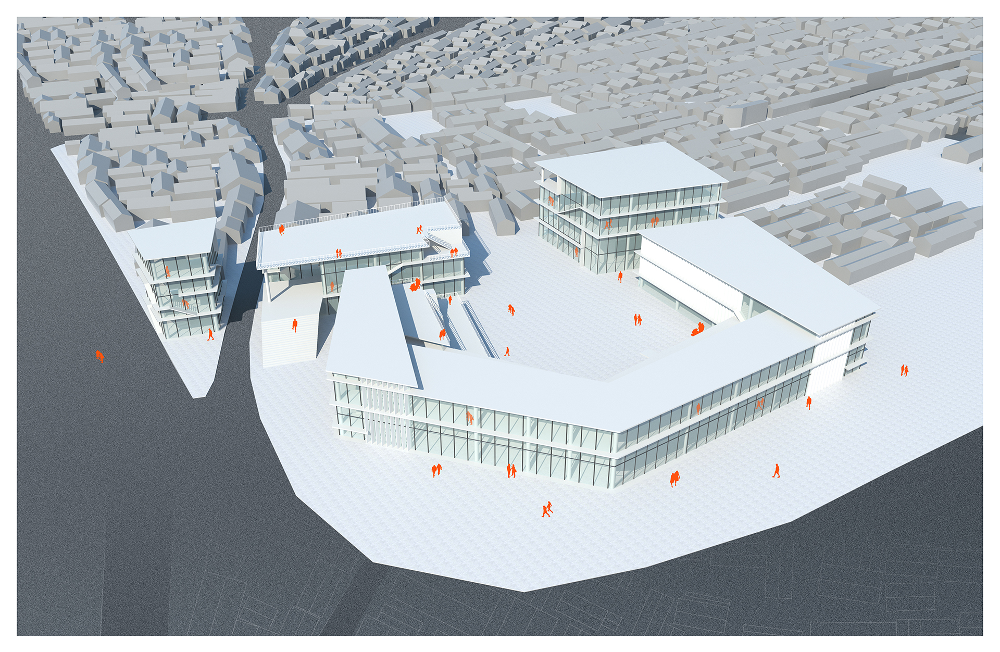
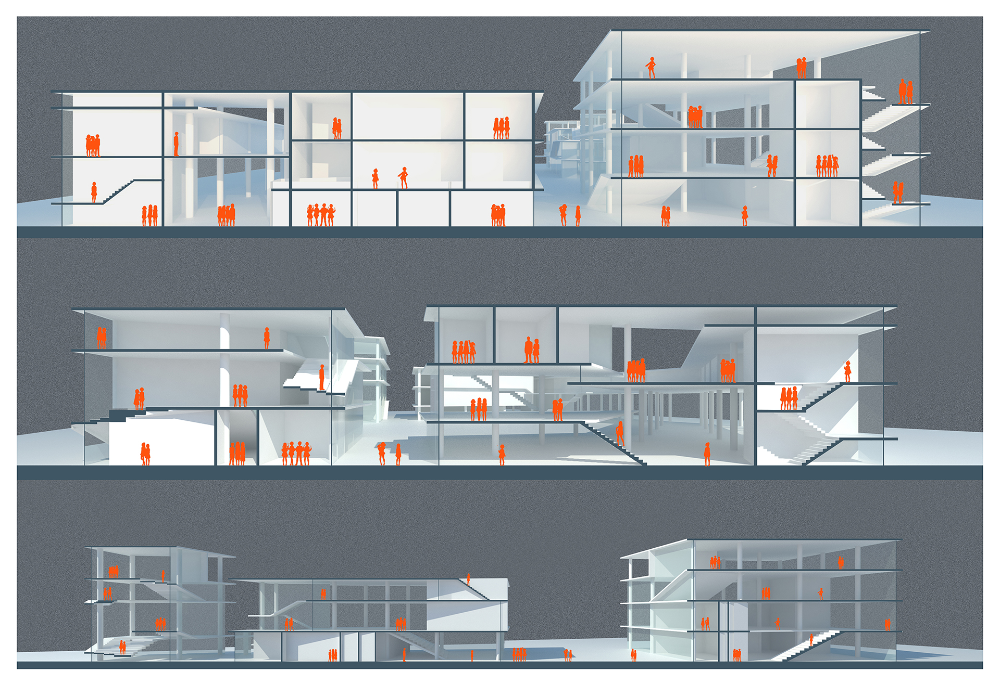

<special>
</special>

## Beijing Dashila Commercial

This is a commercial center design at Dashila, Beijing. It was relatively simple due to lack of time. I designed the shape of this commercial center based on the shape of roads. I placed a public library on the north-west corner, hopping this could attract people to drop by.

The section shows the relationship between different buildings and how people could interact with each other in the building.