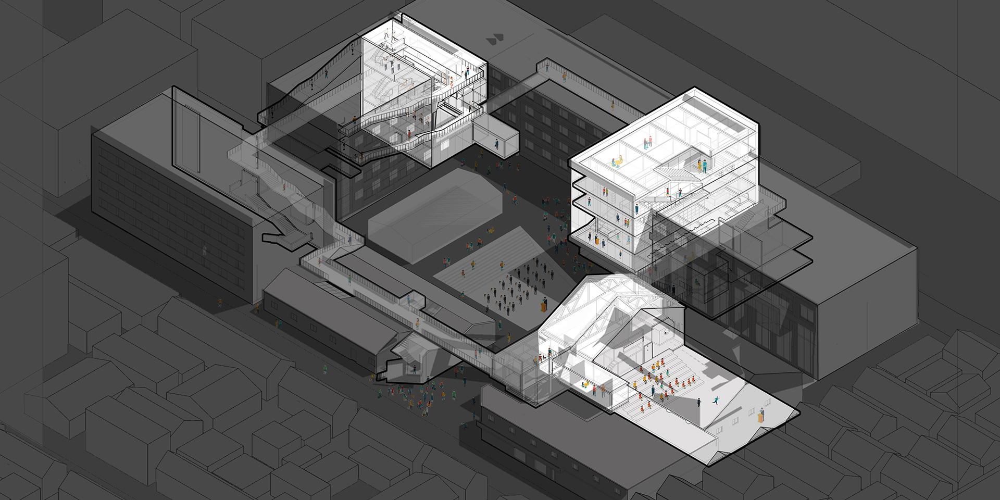
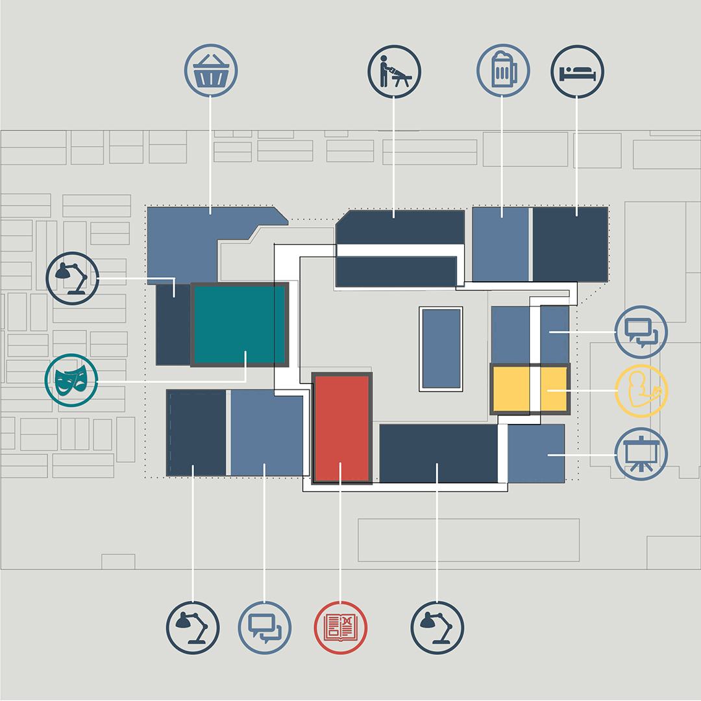
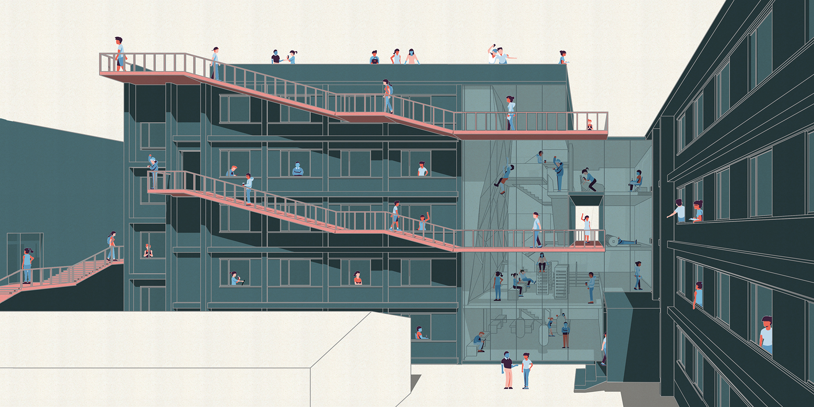

<special>
</special>

## Beijing Fangjia Hutong Courtyard

I made this renovation design together with Yanwen Liu and Huang Qin, under the instruction of Wenjing Huang from Open Architecture. This design was about changing a former factory into a creative industral park.

We inserted three common places into this courtyard, the Gym, the Theater, and the Library, and connected them with a walkway. With those elements, people could wander through the courtyard and meet each other in public spaces.

I designed the Gym. The walkway went all the way to the roof top, where people could take a view of the Fangjia Hutong.