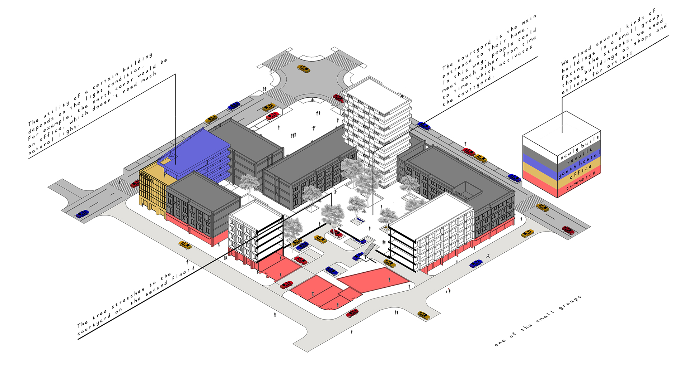
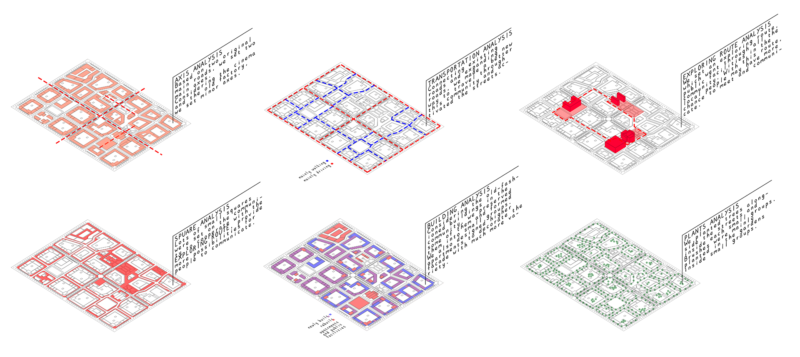
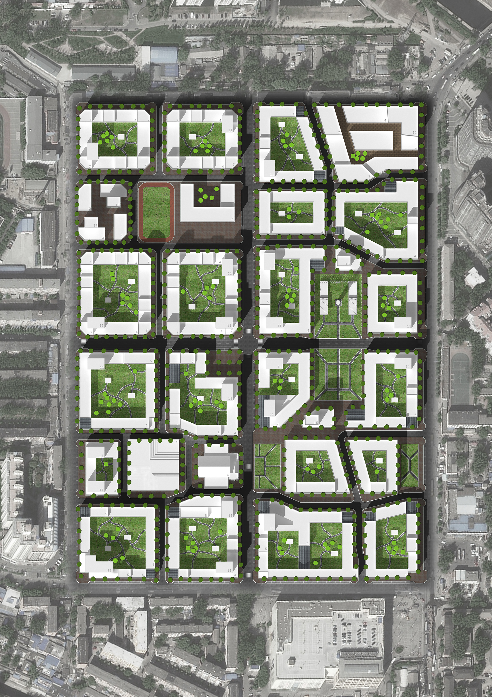

<special>
</special>

## Beijing Jiuxianqiao Community

I made this renovation design of Jiuxianqiao Community with Liren Shen. In this project, we thought about adding a roof on the courtyard, changing it to a parking lot, solving the parking problem in Jiuxianqiao Community. In each block of this community, we added co-working office, youth hotel, and shop to keep this community in a good economy state.

Also we kept an eye on the overall layout of this community.We designed park, theater and primary school for the community.

