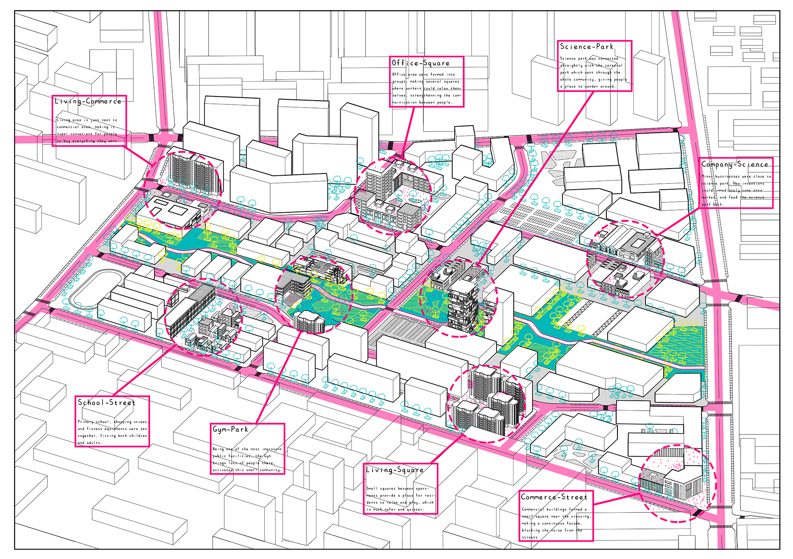
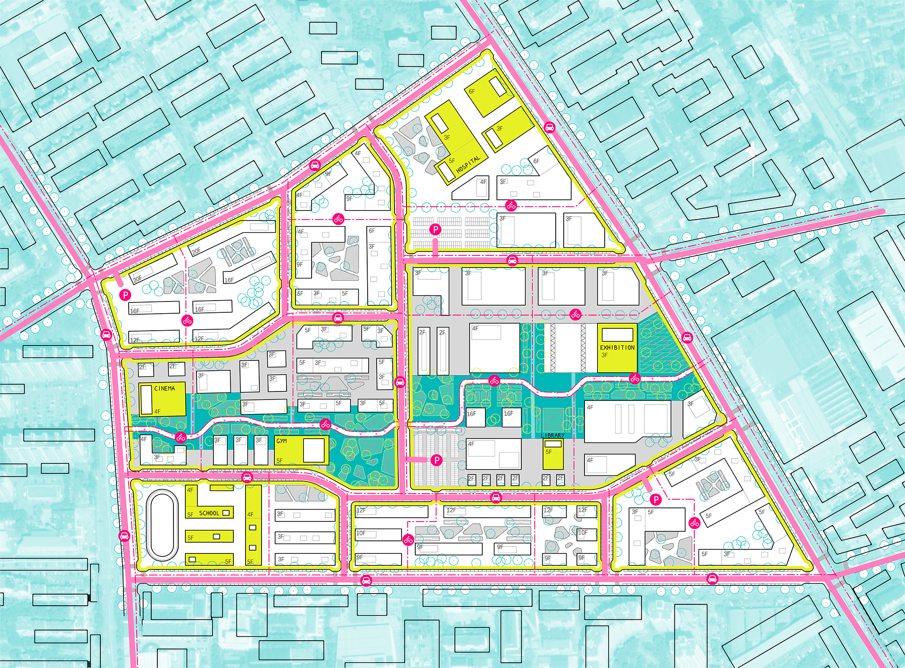
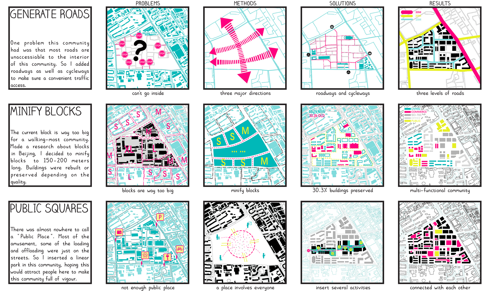

<special>
</special>

## Beijing Shangdi Urban Design

This is an urban planning design for Shangdi district in Beijing. In this project I focused on the relationship within roads, blocks, and squares.

I analysed the weakness of current urban form in Shangdi district, and decided to generate roads, minify blocks, and import public squares from three aspects. Also at that time, I wanted to draw something different. Line drawing looks pretty good on an urban planning design. 

