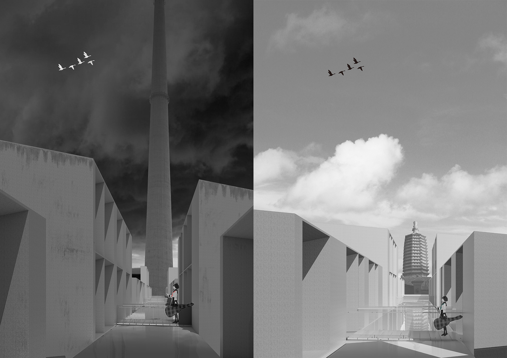
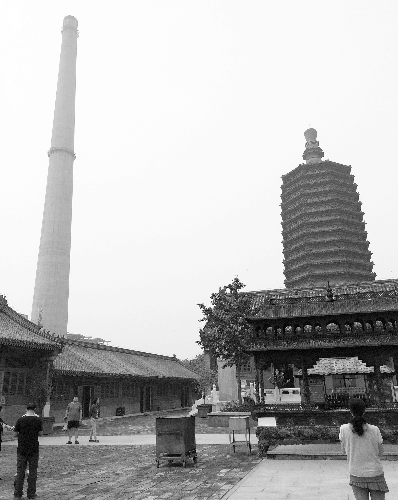
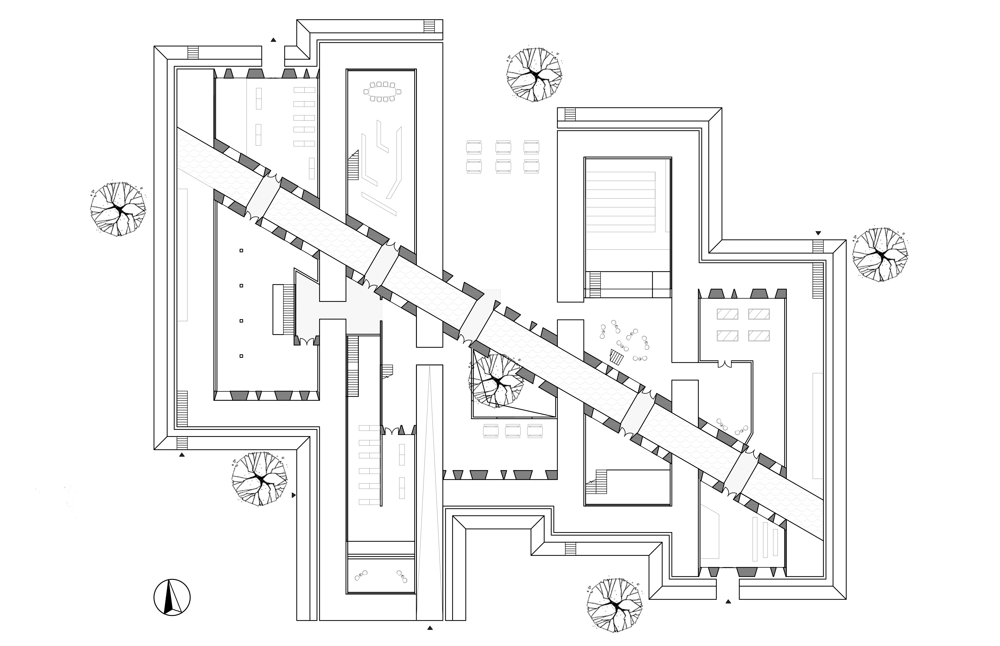

<special>
</special>

## Beijing Tianning Museum

This is a museum design project in Tianning Community, Beijing. I was astonished by the extreme contrast between the great chimney and the Tianning Pagoda. Following is a photo shot in Tianning Temple by myself.

Therefore I designed a history meseum between the chimney adn the Pagoda, recording the history of Tianning Community. Walking on the sidewalks in the museum, you can see the chimney on one side and the Pagoda on the other side. That is what I think about history and time - we reflect on our history and explore the future.

