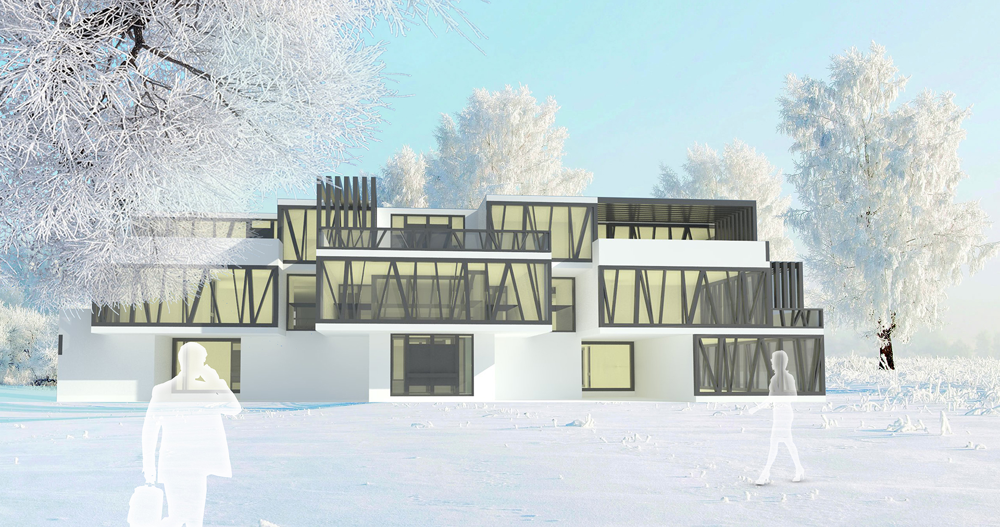
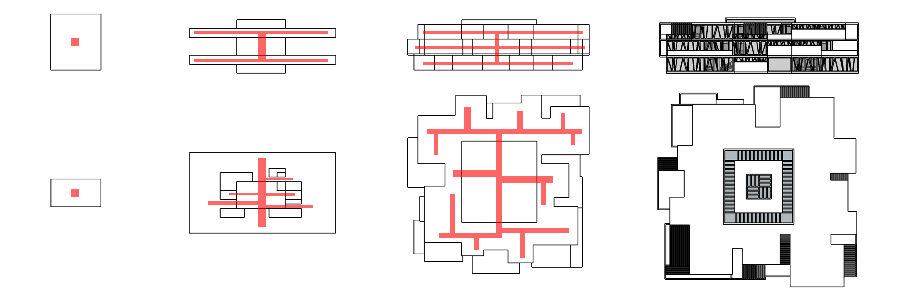
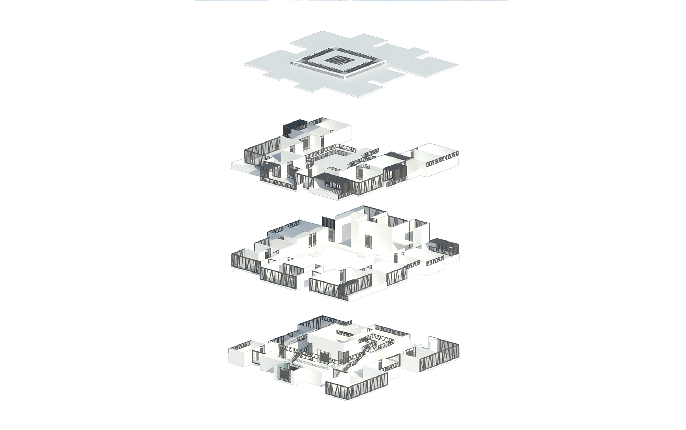

<special>
</special>

## Beijing Tsinghua Hotel

This is a hotel design near Tsinghua University, Beijing. It was the first that I used computer for rendering architecture diagrams. I chose a scene in winter because at that time I was new to Beijing and really love the snow there.

The hotel design started with a multi-function hall in the center. As the space expand both horizontally and vertically, I formed the space into my final design.

