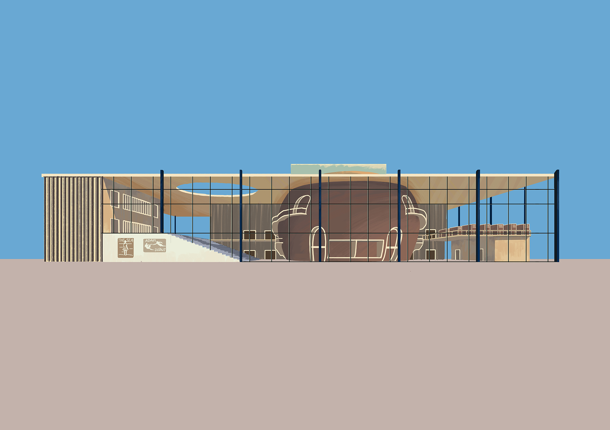
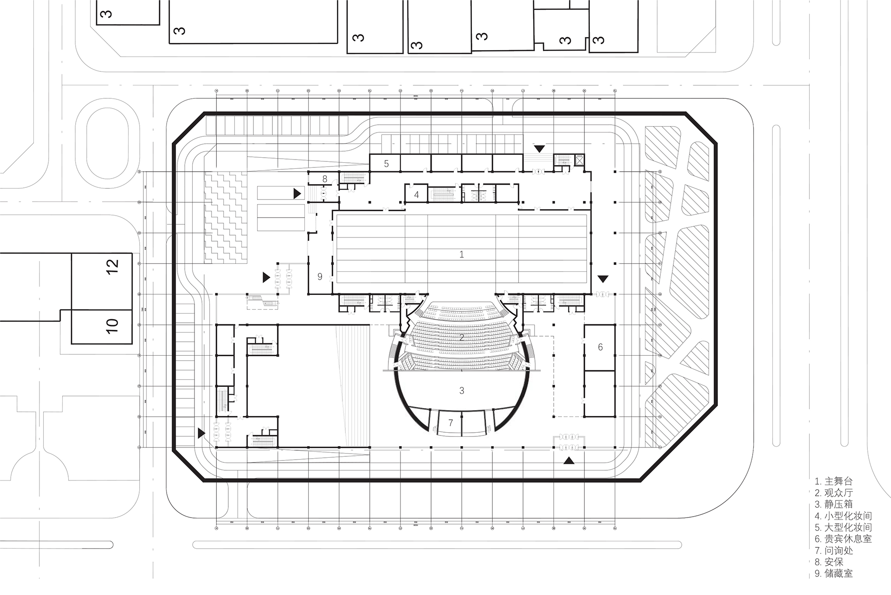
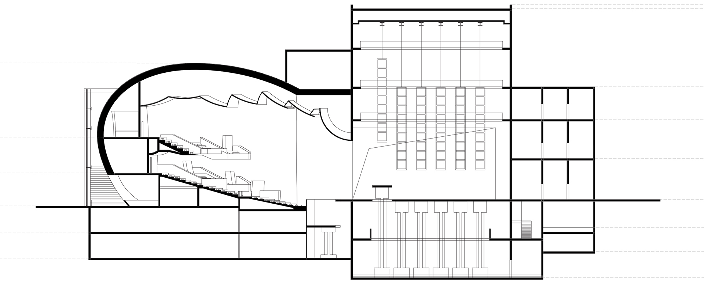
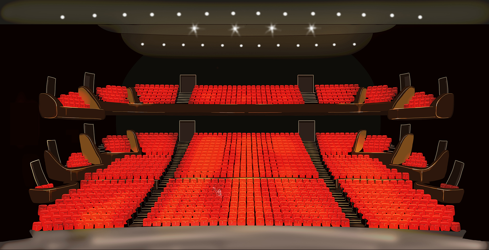

<special>
</special>

## Beijing Wudaokou Cinema Design

This is a cinema design at Wudaokou, Beijing. I visited lots of cinemas in Beijing and really learned a lot from that. I realized that a single building can be extremelly complicated.

I used Rhino to do 3D modeling and grasshopper to generate seats in auditorium. It was really fun coding in grasshopper. In this project, I designed two auditoriums and on the top of the smaller auditorium, I placed an open platform. I hoped that people from the outside could see through the glass and interact with people under sunshine on the platform.

For the inside of the larger auditorium, I drew an illustration of it. I was font of hand drawing at that time, therefore I did not choose to render this scene. I was satisfied with the output.