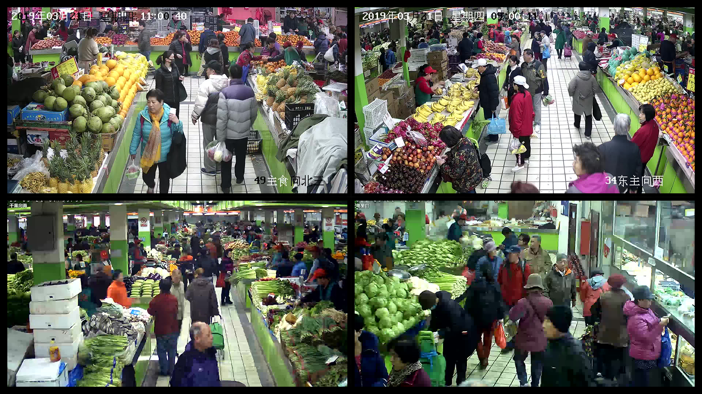
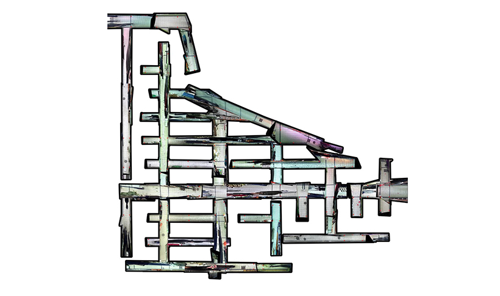
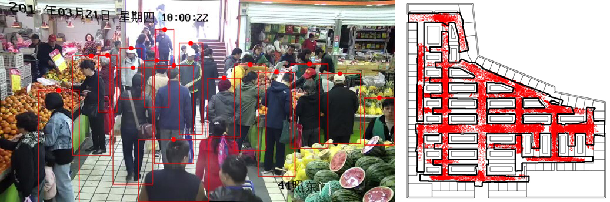
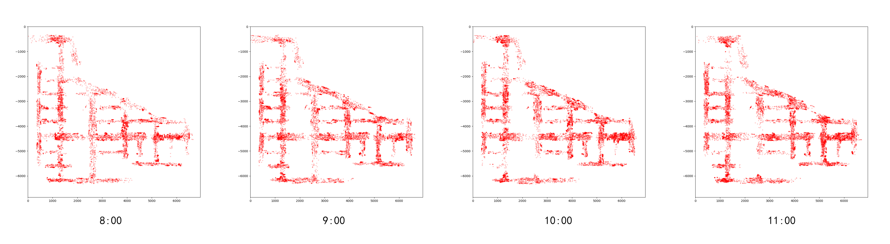
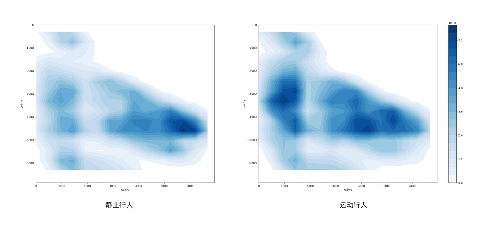

<special>
</special>

## Camera Positioning

After we made experienment about [UWB Positioning](https://zznewclear13.me/posts/uwb-positioning.html) in Tsinghua Zijing Student Supermarket, we changed our target to a larger scale building - Xinmin Market, Beijing. This time we wanted to take advantage of CCTVs in the market. Therefore we conducted a new research of Camera Positioning, and my task was to use camera to get customers' spatio-temporal data and then analyse them.

There are over 50 cameras in Xinmin Market, the raw capture of camera looks like this.

Other than mapping customers' spatio-temporal data on a blank board, I first reconstructed the plan of Xinmin Market based on images captured by cameras.

Then I used YOLO to detect customers' heads and then mapping them onto Xinmin Market's floor plan. I used Kuhn-Munkres algorithm to pair customers in different frames. The result looks like this. The images were not perfect calibrated, but would not cause large deviation during mapping.

With those mapping data, I could analyse customers' spatio-temporal hebavior in different time of a day, or in different part of the Market, or based on thier walking speed. I used Python to do mapping and analysing.

