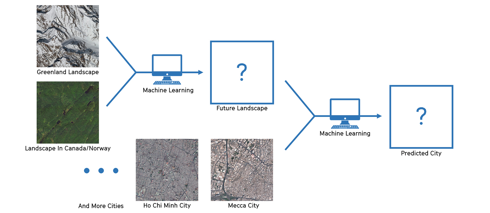
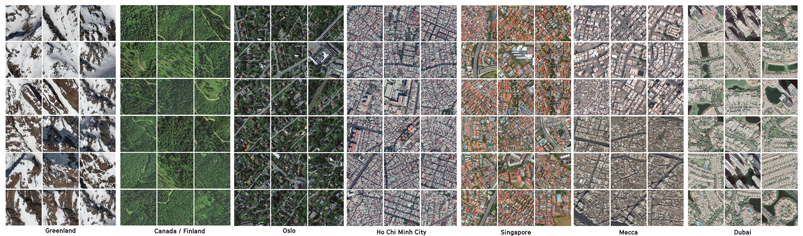
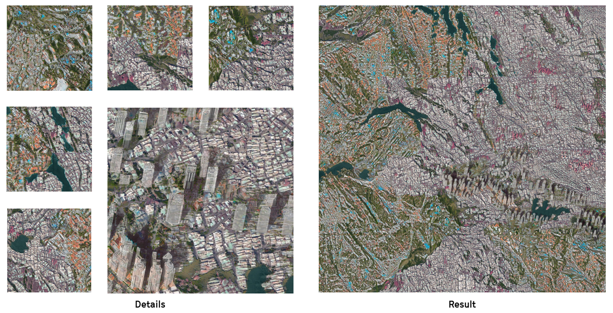

<special>
</special>

## Future of Greenland

<iframe src="https://www.youtube.com/embed/auKrza0eMA4" frameborder="0" allow="accelerometer; autoplay; encrypted-media; gyroscope; picture-in-picture" allowfullscreen></iframe>

Under current context of global warming, Greenland is losing 294 billion metric tons ice per year. This is a project aimng to raise people's aware of global warming and an architectural practice of embedding machine learning into urban design. 

In this research project, Huilin Liu, Xiaoman Zhang, and me predicted a possible future of Greenland using machine learning. We predicted that people in Southeast Asia and Middle East would immigrate to Greenland due to climate change. We used machine learning to generate different parts of the city, then combined and interpreted those parts to form our final prediction of the entire city.

Following is our workflow.

We chose Oslo, Ho Chi Minh City, Singapore, Mecca, and Dubai as our machine learning city. Here are images from our dataset.

Then we used machine learning to generate our future city - the Future of Greenland. We did some manually adjustments to combine machine learning results. Those high-rises were added manually.

