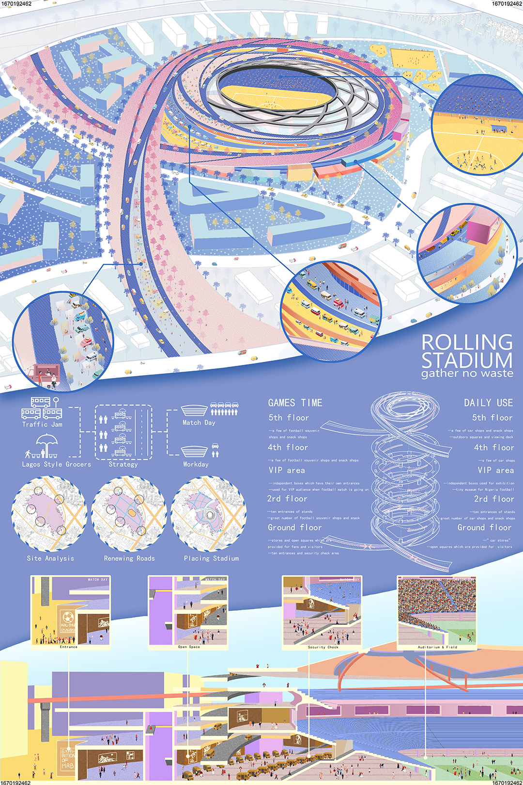

<special>
</special>

## Lagos Stadium Competition

I made this stadium design for ArchOutLoud Design Competition, together with Xiyu Chen and Ruofan Xue. In this competition, we were asked to design a new multi-purpose stadium at the former Olusosun Landfill in Lagos, Nigeria.

In our design project, "Rolling Stadium Gathers No Waste", the stadium serves in two ways. On match days, the stadium could provide space for 40,000 people to enjoy themselves in the event. Alternatively, on non-match days, the stadium could transform into a commercial complex.

Considering the local feature of Lagos, we focused on the enormous potential of cars in Lagos and therefore, designed a ramp system for the stadium for cars to go inside the stadium.
