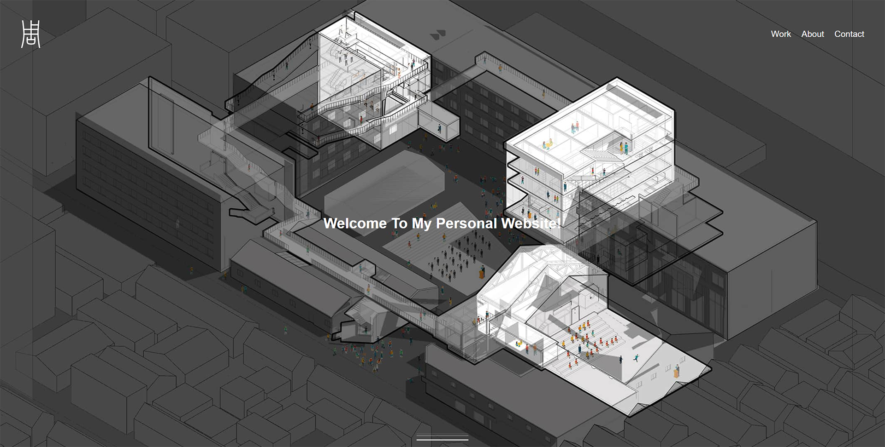

<special>
</special>

## My Personal Website

If you are reading this, you are visiting [My Personal Website](https://zznewclear13.me)! I have put the source code of my personal website on [Github](https://github.com/zznewclear13/zznewclear13.me).

It all started with a wierd idea that I should put all my design projects on my personal website on Dec 04, 2019, when I was cleaning my folder to compose my portfolio.

I started building my personal website on Dec 19, 2019, and learned html, css, and javascript afterwards. Thanks to tutorials by [DevTips](https://www.youtube.com/channel/UCyIe-61Y8C4_o-zZCtO4ETQ), I really learned a lot from them. And to be honest, html is really charming. It is not only about coding, but also designing a website from blank.

I did not use WordPress or any template to build my website, because I am super cool! 