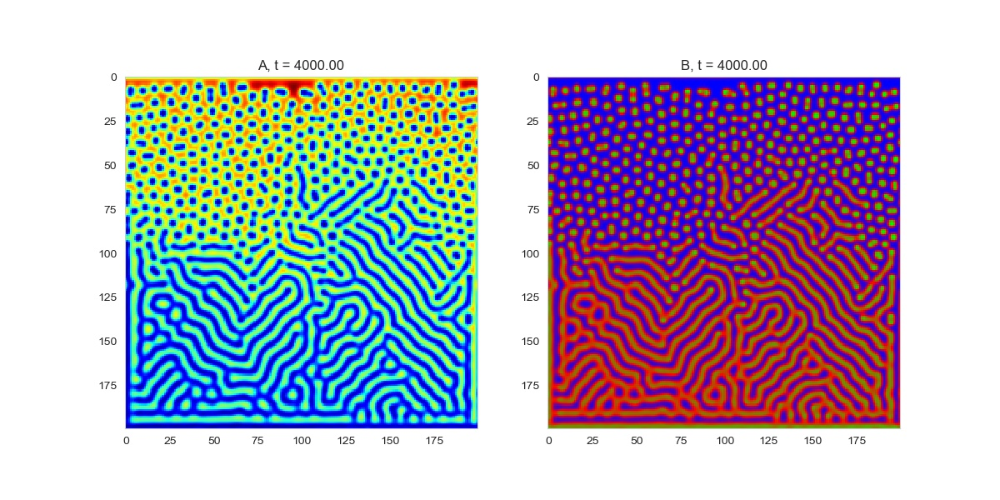
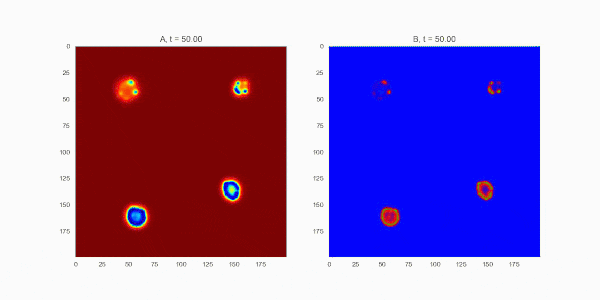
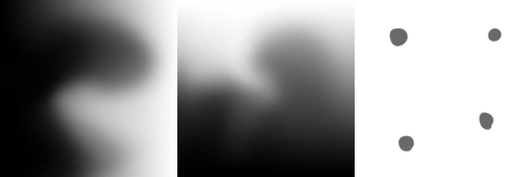

<special>
</special>

## Reaction Diffusion Systems

When I was doing an urban design project in tech-studio, I was astonished by the beauty of Turing Pattern. The Turing Pattern is related to Reaction Diffusion Systems, mathematical models which correspond to several physical phenomena. Following is one of my output images. 

I was thinking that maybe we can apply this kind of pattern into our design process. This kind of random but organised pattern is so charming. This gif is 13.5MB and might take some time to load.

In my program, I used three gray scale images to generate those Turing Patterns: feed-rate, kill-rate, and initial image. I used feed-rate and kill-rate images to create a (f,k) set which can vary according to its location.

This page has not been finished yet!