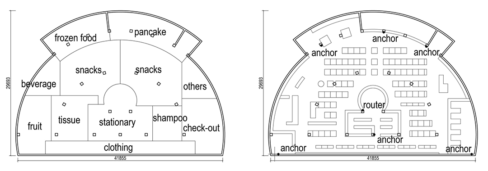
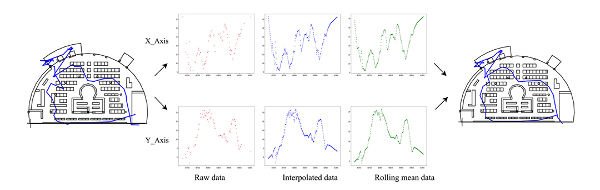
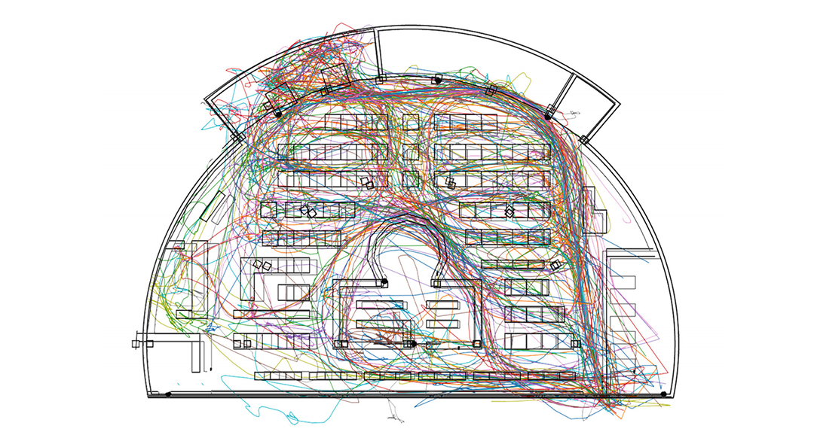

<special>
</special>

## UWB Positioning

This is a research called **THE INFLUENCE OF SUPERMARKET SPATIAL LAYOUT ON
SHOPPING BEHAVIOR AND PRODUCT SALES**, which has been publiched on [CAADIRA 2019](http://papers.cumincad.org/cgi-bin/works/paper/caadria2019_666). With the instruction of Weixin Huang, this reasearch was carried out by Lijing Yang, Bingyu Cheng, Nachuan Deng and me.

We conducted our research in Tsinghua Zijing Student Supermarket, would redesign the student supermarket based on our research of students' shopping behavior. This is the plan of the supermarket.

We placed six anchors in the supermarket and asked students carrying a tag with them when shopping. With this tag, anchors could log the distance between tag and themselves and upload the data onto our server. Then we could get the position of the tag using trilateration.

Raw data were filtered, interpolated, and smoothed using moving average to reduce possible deviation. Following is a collection of our final results.

